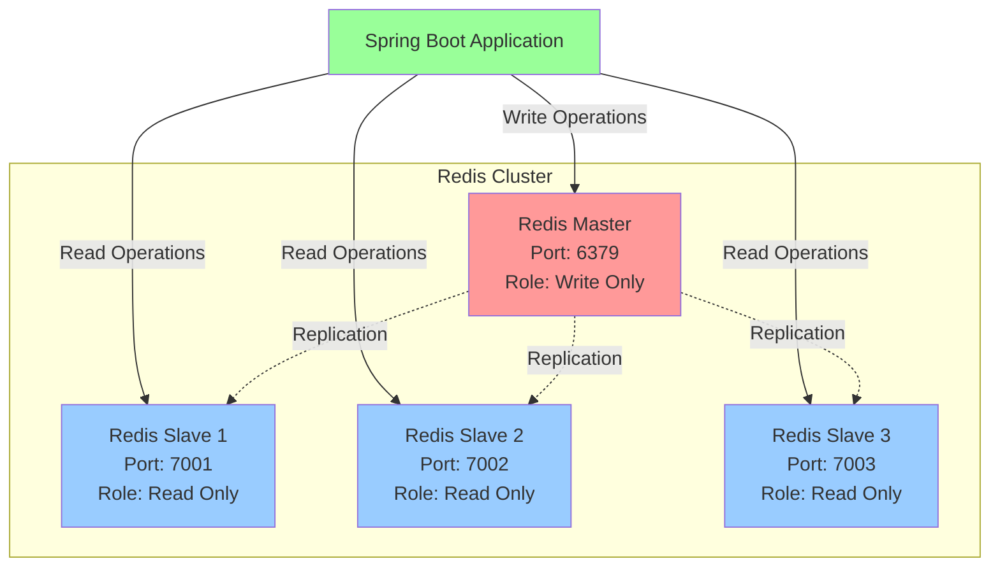
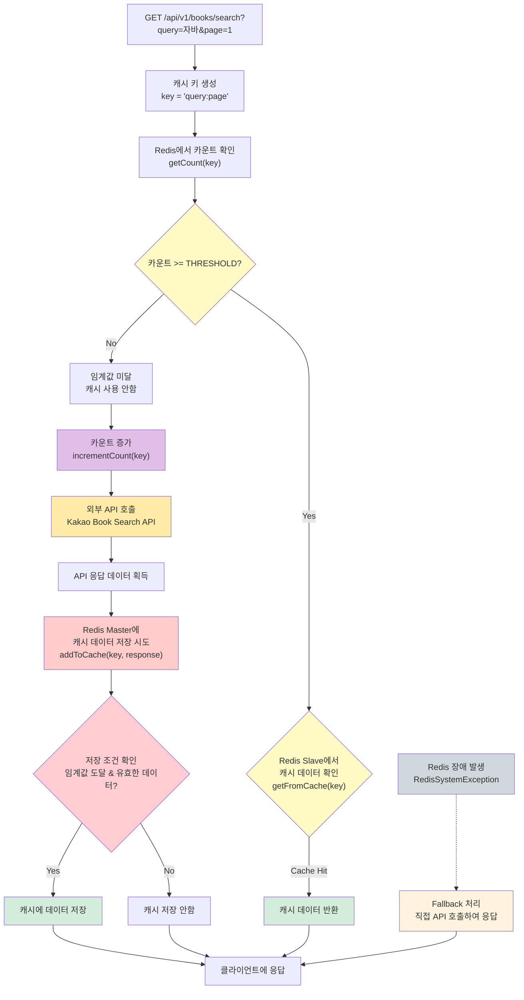

# Redis Cache

- Redis Cache를 사용하는 상황에서 HA(High Availability)와 부하 분산을 고려하여 Master/Slave 구성을 적용해본다.
- 더 나아가, Redis Sentinel을 활용한 자동 장애 조치(Failover)를 구현한다.
- 추가적으로 Redis Cluster에 대한 학습까지 진행한다.

## 프로젝트 목표

> [Redis replication - redis document](https://redis.io/docs/latest/operate/oss_and_stack/management/replication/)

1. 레디스 서버에 장애가 발생하여 죽었을 때, 서비스에 문제가 없도록 대응하는 방법은 무엇일까?
    - 캐시 호출이 안된다면, 직접 외부 API를 호출하는 구조를 생각해볼 수 있을 것 같음.
    - 또한, 다른 레디스 서버에게 처리를 위임하는 방법도 있을 것으로 예상

2. 레디스 서버가 다시 살아났을 때, 다시 캐시 저장소로 사용할 수 있도록 대응하는 방법은 무엇일까?
    - 키워드: `Reconnect`, `RedisSystemException`
    - https://meetup.nhncloud.com/posts/379

3. 만약, 캐시 데이터를 업데이트 시켜야할 때 어떻게 잘 업데이트를 할 수 있을까?
    - DELETE/INSERT 방식의 경우 텀이 발생하는데 그동안 트래픽이 몰린다면?
    - MySQL - `ALTER TABLE ... RENAME TO ...` 방식이 생각이 남.
    - 또한, 원자적으로 `Lua Script`를 활용할 수 있을까?

---

## 아키텍처 다이어그램

### Redis Master/Slave 구성도

### 캐시 처리 플로우

## 테스트 시나리오

### 1단계: 단일 Master 테스트

- **구성**: Master 1개 (6379)
- **목적**: 기본 캐시 동작 확인
- **결과**: 정상적인 캐시 저장/조회 확인

### 2단계: Master + Single Slave 테스트

- **구성**: Master 1개 (6379) + Slave 1개 (7001)
- **목적**: 읽기/쓰기 분산 확인
- **결과**:
    - 쓰기 → Master
    - 읽기 → Slave 우선

### 3단계: Master + Multiple Slaves 테스트

- **구성**: Master 1개 (6379) + Slaves 3개 (7001, 7002, 7003)
- **목적**: 읽기 부하 분산 및 가용성 확인
- **결과**:
    - 읽기 요청이 여러 슬레이브에 분산
    - 슬레이브 장애 시 다른 슬레이브로 자동 전환
