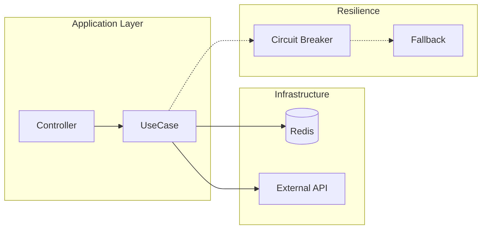
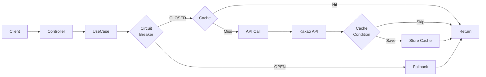
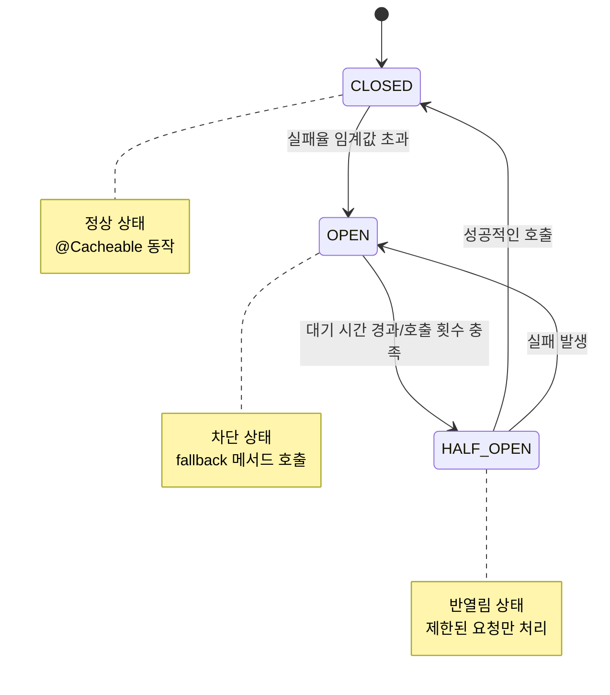
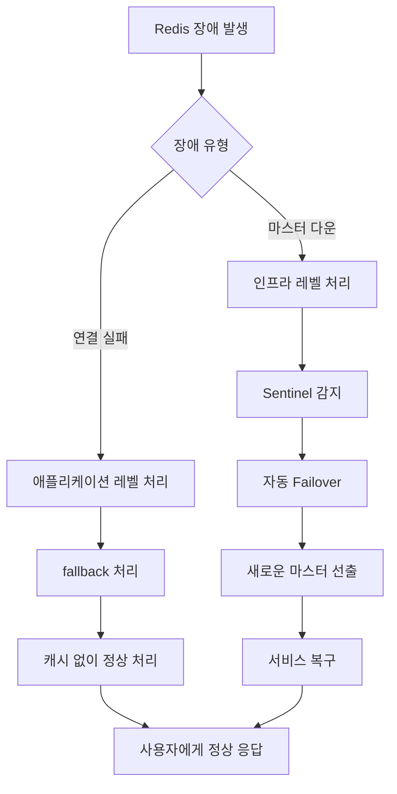

# Redis Cache 프로젝트

## 프로젝트 개요

- 레디스를 활용한 캐시 시스템 구현 및 장애 대응 방안 학습
- 외부 시스템의 장애가 애플리케이션까지의 장애로 전파되지 않도록 구성하는 것이 목표
- 가용성을 높이기 위한 구조는 어떻게 만들어야 할까?

## 아키텍처 및 흐름

**현재 구성:**

```
Controller → UseCase (Circuit Breaker + Cache) → Adapter → External API
```




### 전체 시스템 플로우




### 서킷브레이커 상태 전환



### Redis 장애 대응 시나리오



## 학습 목표

### Redis 장애 대응 방안

Redis 서버 장애가 발생해도 서비스가 문제없이 동작하는 구성 

#### 1. 장애 처리 (애플리케이션 레벨, Fallback)

- 가장 간단하게 `try-catch`로 예외 처리하는 방법 
- 서킷브레이커를 통한 장애 전파 차단
- 외부 API 직접 호출을 통한 Fallback 처리

#### 2. 장애 대응 (인프라 레벨, HA)

- Master-Slave 구성을 통한 읽기 성능 향상
- Sentinel을 통한 자동 장애 감지 및 failover
- Cluster 구성을 통한 분산 처리 및 고가용성 확보

## 주요 기능

### 1. 캐시 시스템

- Redis를 활용한 도서 검색 결과 캐시
- TTL 30분 설정으로 메모리 효율적 관리 
- 캐시 키: `query:page` 형태로 구성

### 2. 서킷브레이커

- Redis 캐시 장애 시 자동 fallback 처리
- 장애 전파 차단을 통한 시스템 안정성 확보
- AOP 기반 어노테이션으로 간결한 구현
